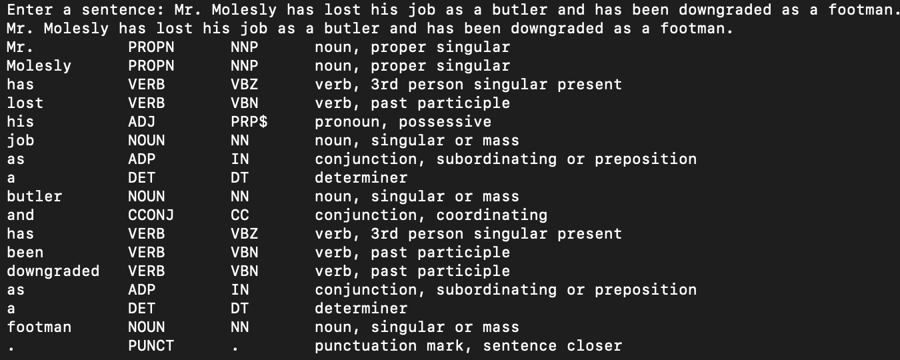
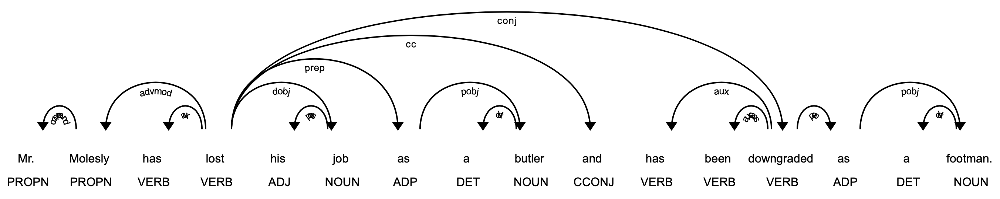
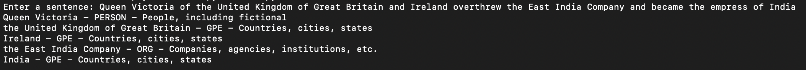
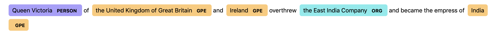

# Parts of Speech Tagging and Named Entity Recognition

- `cd` into the repository and run `python pos_tagging.py`

It assigns part of speech to each individual token of the input text and visualises the sentence by generating a parse tree equivalent.

- `cd` into the repository and run `python ner.py`

It identifies all the named entities, their types and visualises them in the text.

